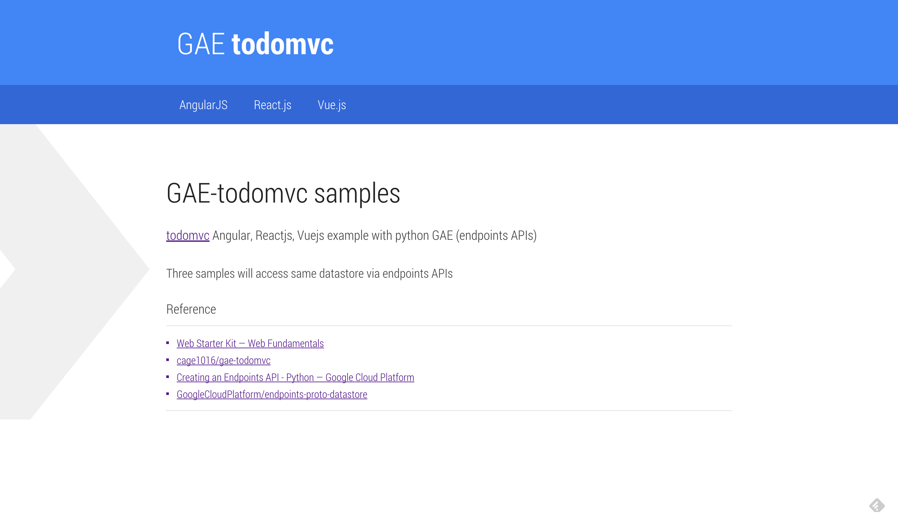

# GAE-todomvc
> todomvc examples

整個 GAE-todomvc 是選用 [TodoMVC](http://todomvc.com/) 中 `AngularJS`, `React.js` 及 `Vue.js` 為前端框架 + 後端為 `python GAE` endpoints APIs 存取相同的 datastore。

## Specs

- [GAE-python](https://cloud.google.com/appengine/docs/python/)
- [endpoints APIs](https://cloud.google.com/appengine/docs/python/endpoints/)
  - [GoogleCloudPlatform/endpoints-proto-datastore](https://github.com/GoogleCloudPlatform/endpoints-proto-datastore)

## Getting Started

GAE todomvc 的 gcloud SDK 為 `0.9.64`

```sh
# Get gcloud
$ curl https://sdk.cloud.google.com | bash

# Get App Engine component
$ gcloud components update app
$ gcloud components update gae-python

# Clone repo from github
$ git clone https://github.com/cage1016/gae-todomvc

# Install pip packages
$ sudo pip install -r requirements.txt -t lib

# Install npm packages
$ npm install

# Install bower packages
$ bower install
```

GAE todomvc 中 `Vue.js` 範例中使用到了 `vue-resource` library，因為 `vue-resource` 模組預設沒有 `update: {method: 'put'}` method，所以在執行 `gulp` 時，需自己稍作修改。

```sh
# switch to bower_components
$ cd bower_components

# clone vue-resource repo from github
$ git clone https://github.com/vuejs/vue-resource

# install vue-resource require packages
$ npm install

# add update method
# /bower_components/vue-resource/src/resource.js
# add "update: {method: 'put'}" at line 109

# rebuild vue-resource
$ npm run build

# go back
$ cd ../..

# Build
$ gulp

# Run GAE locally
$ dev_appserver.py app.yaml
```

## Screencapture



## 參考資料
- [TodoMVC](http://todomvc.com/)
- [Web Starter Kit — Web Fundamentals](https://developers.google.com/web/tools/starter-kit/)
- [[React] 資源整理 « Huli's Blog](http://huli.logdown.com/posts/276040-react-resource-consolidation)
- [React & Flux Workshop](http://www.slideshare.net/xmlilley/react-flux-50660816)
- [Reactjs-JQuery-Vuejs-Extjs-Angularjs对比 - 【当耐特】 - 博客园](http://www.cnblogs.com/iamzhanglei/p/4481521.html)
- [深入浅出React（一）：React的设计哲学 - 简单之美](http://www.infoq.com/cn/articles/react-art-of-simplity)
- [深入浅出React（二）：React开发神器Webpack](http://www.infoq.com/cn/articles/react-and-webpack?utm_source=infoq&utm_medium=related_content_link&utm_campaign=relatedContent_articles_clk)
